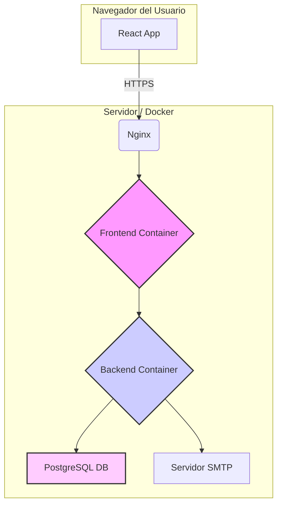

# PetMatch - Encuentra la Pareja Perfecta para tu Mascota

PetMatch es una aplicación web moderna, de alto rendimiento y segura, diseñada para que los dueños de mascotas puedan encontrar la pareja ideal para sus compañeros peludos.

## Diagrama de Arquitectura

El proyecto está completamente contenedorizado con Docker, asegurando un entorno de desarrollo y despliegue consistente y aislado.



## Características Principales

-   **Perfiles Detallados:** Creación de perfiles para usuarios y sus mascotas.
-   **Sistema de "Swipe":** Interfaz intuitiva para descubrir y conectar con otras mascotas.
-   **Chat en Tiempo Real:** Comunicación segura entre dueños una vez que se produce un "Match".
-   **Panel de Administración:** Vista de superusuario para gestionar la plataforma.

### Características Técnicas y de Seguridad

-   **Autenticación Segura con Cookies `HttpOnly`:** En lugar de `localStorage`, se usan cookies `HttpOnly` para almacenar los tokens de sesión, mitigando el riesgo de ataques XSS.
-   **Validación de Datos de Entrada:** Se valida toda la información enviada al backend para prevenir inyecciones de datos maliciosos y asegurar la integridad de la base de datos.
-   **Protección contra Inyección SQL:** Uso de JPA y consultas parametrizadas para eliminar el riesgo de inyecciones SQL.
-   **Rendimiento Optimizado (Code Splitting):** El código del panel de administración se carga de forma perezosa (`React.lazy`), reduciendo el tamaño del paquete inicial para los usuarios normales.
-   **Experiencia de Usuario Mejorada (UX):**
    -   **Indicadores de Carga (Skeletons):** La interfaz muestra "esqueletos" de contenido mientras se cargan los datos, mejorando la percepción de velocidad.
    -   **Notificaciones "Toast":** Se usan notificaciones no intrusivas para informar al usuario de eventos como matches o errores.
-   **Capa de Servicios API Centralizada:** Toda la comunicación con el backend se gestiona a través de una capa de `axios` centralizada, mejorando la mantenibilidad y la gestión de errores.

## Tecnologías Utilizadas

-   **Backend:**
    -   Java 17, Spring Boot 3, Spring Security, JPA (Hibernate)
    -   PostgreSQL, Lombok, MapStruct
-   **Frontend:**
    -   React 18, Vite, React Router
    -   **Axios** para peticiones HTTP.
    -   **React-hot-toast** para notificaciones.
-   **Contenedorización:**
    -   Docker y Docker Compose para orquestar todos los servicios.
    -   Nginx para servir el frontend de producción.

---

## Cómo Empezar (Entorno de Desarrollo)

1.  **Clona el repositorio:** `git clone https://github.com/tu-usuario/petmatch.git && cd petmatch`
2.  **Crea tu archivo de entorno:** Copia la plantilla con `cp .env.example .env`.
3.  **Configura tus credenciales:** Edita el archivo `.env` y añade tus credenciales para el servidor de correo.
4.  **Instala las dependencias del frontend:** `cd petmatch-frontend && npm install && cd ..`
5.  **Levanta los contenedores:** `docker-compose up --build`
6.  **Accede a la aplicación:**
    -   Frontend: `http://localhost:3000`
    -   API Backend: `http://localhost:8080`

---

## Ejecución Limpia (Resolución de Problemas)

Si encuentras errores inesperados o si los cambios en el código no se reflejan, sigue estos pasos para hacer un reinicio completo y limpio de la aplicación. Esto elimina todos los contenedores, volúmenes (incluida la base de datos) e imágenes antiguas.

```bash
# 1. Detener todos los contenedores en ejecución
docker-compose down

# 2. Eliminar el volumen de la base de datos (¡ESTO BORRARÁ TODOS LOS DATOS!)
# El flag -v es crucial para eliminar los volúmenes anónimos.
docker-compose down -v

# 3. Eliminar imágenes de Docker cacheadas para forzar una reconstrucción completa
# Esto es útil si has hecho cambios en los Dockerfile.
docker-compose build --no-cache

# 4. Limpiar la caché de npm en el frontend (Opcional, pero recomendado)
# Asegúrate de estar en el directorio raíz del proyecto.
cd petmatch-frontend && rm -rf node_modules && npm cache clean --force && npm install && cd ..

# 5. Levantar todo de nuevo desde cero
docker-compose up --build
```

---

## Manual de Despliegue en Producción

### Prerrequisitos
-   Un servidor con Docker y Docker Compose.
-   Un nombre de dominio apuntando a la IP de tu servidor.
-   Certificados SSL/TLS (recomendado: Let's Encrypt).

### Pasos
1.  **Clona el repositorio** en tu servidor.
2.  **Configura el `.env` de producción:**
    -   Crea el archivo: `cp .env.example .env`
    -   Edítalo (`nano .env`) con valores de producción: una contraseña de base de datos segura, un secreto JWT aleatorio y las URLs públicas de tu dominio.
3.  **Instala dependencias del frontend:** `cd petmatch-frontend && npm install && cd ..`
4.  **Construye y levanta los servicios:** `docker-compose up --build -d`
5.  **Configura un Reverse Proxy (Nginx):** Configura el Nginx de tu servidor para redirigir el tráfico de tu dominio (puertos 80 y 443) al contenedor del frontend (puerto 3000).
6.  **Verifica el estado:** `docker-compose ps`
7.  **Monitoriza los logs:** `docker-compose logs -f backend`

### Consideraciones de Seguridad
-   Asegúrate de que `.env` esté en tu `.gitignore`.
-   Usa contraseñas y secretos fuertes en producción.
-   Configura un firewall en tu servidor para permitir tráfico solo en los puertos necesarios (80, 443, 22).
